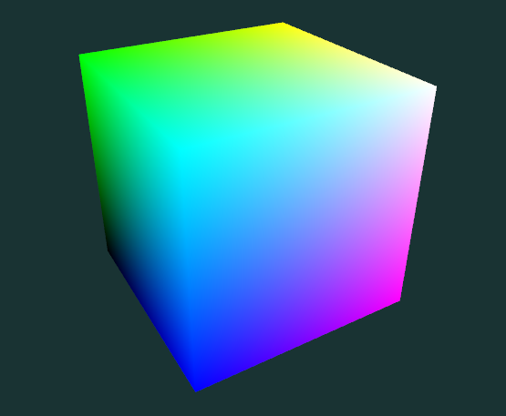
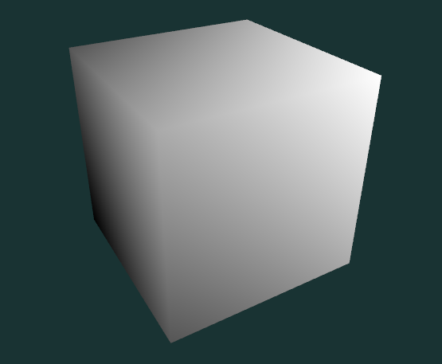

# Quiz Cours 2 : Nuanceur de fragments

Compléter le nuanceur de fragments ([frag.glsl](frag.glsl)), recevant la couleur de fragment, afin d’afficher le fragment en noir et blanc.

Couleurs reçues :

Résultat attendu :

