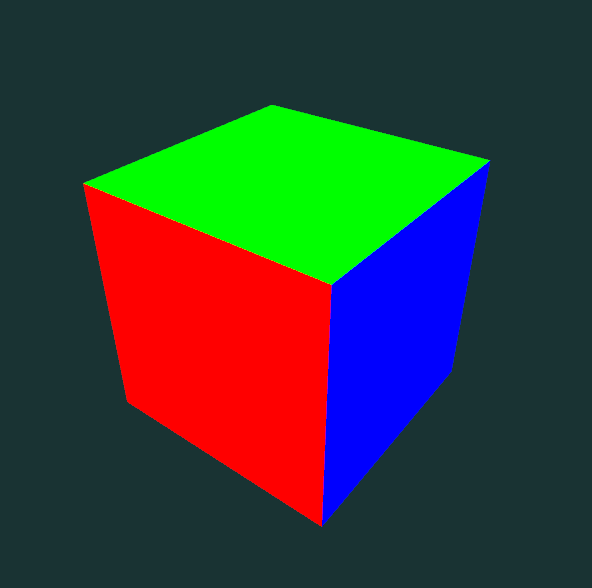

# Quiz Cours 2 : Nuanceur de sommets

Compléter le nuanceur de sommets ([vert.glsl](vert.glsl)), recevant une coordonnée 3D et une normale de face, afin d’afficher un cube où chaque face observée a une couleur différente.

