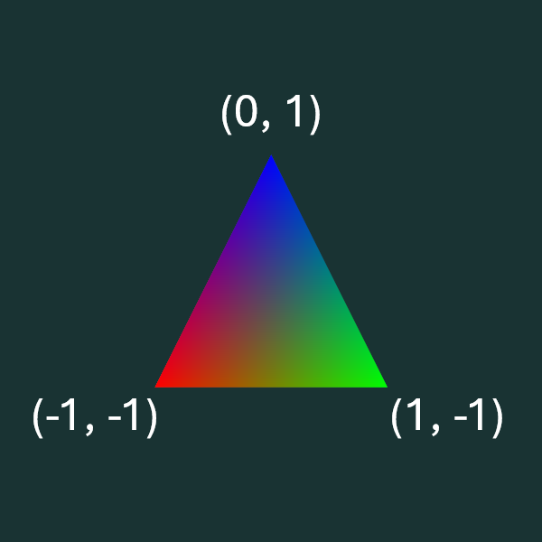
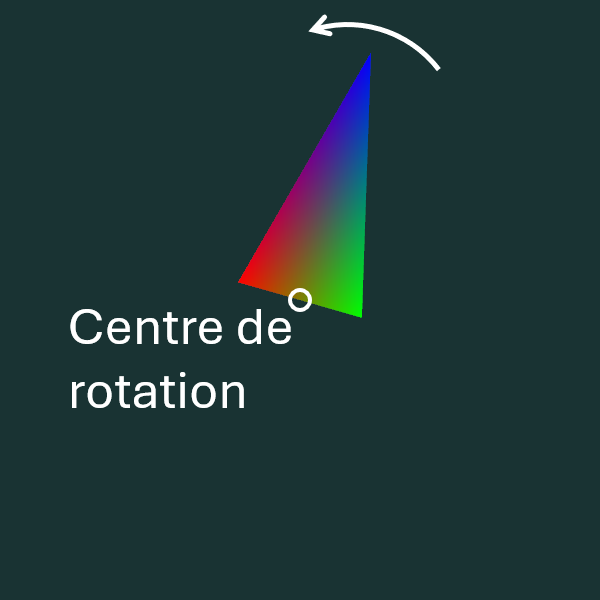

# Exercice cours 3 : Ordre des transformations

Compléter la fonction d’affichage (*drawFrame*) dans [main.cpp](main.cpp) de façon à obtenir un triangle qui tourne autour de sa base.

Les coordonnées des sommets du triangle de base sont (en *xy*):

On veut une rotation en sens antihoraire autour de l'axe des z où le centre de rotation est à la base (rouge-verte) du triangle, et celui-ci doit être écrasé de 50% sur sa largeur.

## Contrôles

* F5 : capture d'écran.
* R : réinitialiser la position de la caméra.
* \+ et - :  rapprocher et éloigner la caméra orbitale.
* haut/bas : changer la latitude de la caméra orbitale.
* gauche/droite : changer la longitude ou le roulement (avec shift) de la caméra orbitale.
* clic droit ou central : bouger la caméra en glissant la souris.
* roulette : rapprocher et éloigner la caméra orbitale.
