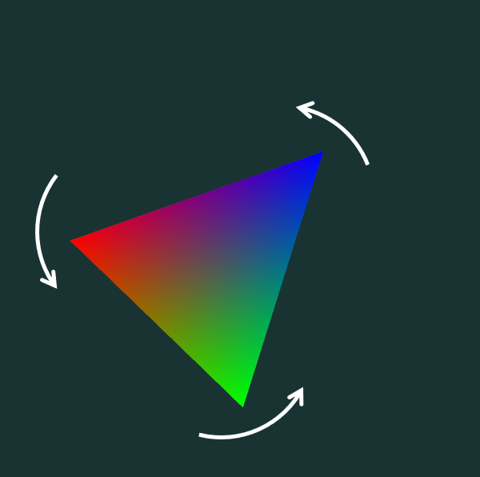

# Exemple C03_Intro_Transformations

* Sans utiliser les *glRotate* et compagnie, et seulement en modifiant le nuanceur de sommets ([vert.glsl](vert.glsl)), on veut effectuer une rotation d’un triangle dans le temps.
* La variable uniforme *angle* est déjà mise à jour pour nous et représente la rotation dans le temps.
* On dépoussière notre trigonométrie pour effectuer une rotation autour de l’axe des z!
* Rappel : les fonctions trigo (sin, cos) prennent des radians, pas des degrés.

