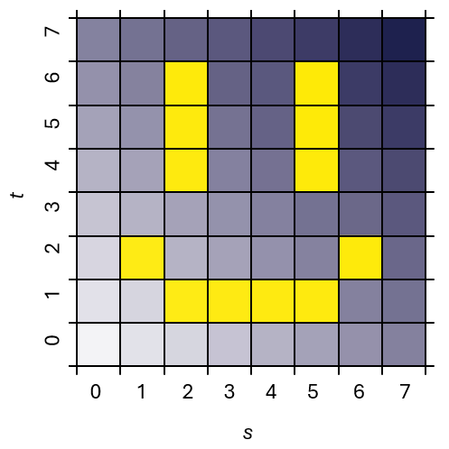
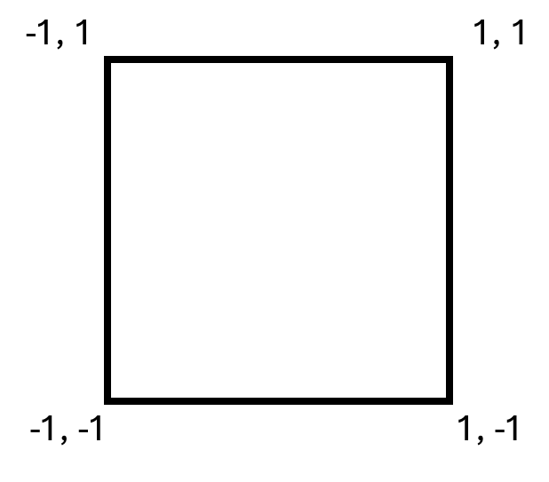

# Introduction cours 4 : Image

Jusqu’à présent, on appliquait des couleurs uniformes ou interpolées par sommet sur nos primitives. On veut maintenant essayer d’appliquer une image sur un carré en modifiant seulement le nuanceur de fragments ([frag.glsl](frag.glsl)).

L'image en question est de 8x8 pixels (donc très petite) et on la charge dans une variable uniforme représentant un tableau 1D de 64 vec4. Elle est chargé en mémoire en format rangée-major, c-à-d que dans le tableau 1D, les pixels de la même rangée sont contigus. Le premier pixel dans le tableau est le pixel bas-gauche.

Le carré a les coordonnées de sommets suivantes (plan *xy*, donc *z*=0) :

On va donc se servir des coordonnées originales des sommets pour faire l'échantillonage dans le tableau de pixels de l'image.

## Contrôles

* F5 : capture d'écran.
* R : réinitialiser la position de la caméra.
* \+ et - :  rapprocher et éloigner la caméra orbitale.
* haut/bas : changer la latitude de la caméra orbitale.
* gauche/droite : changer la longitude ou le roulement (avec shift) de la caméra orbitale.
* clic droit ou central : bouger la caméra en glissant la souris.
* roulette : rapprocher et éloigner la caméra orbitale.
