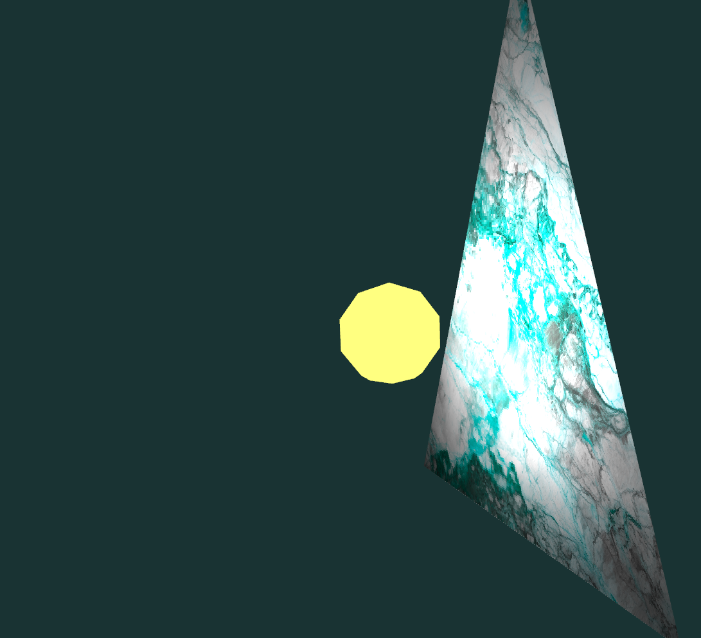
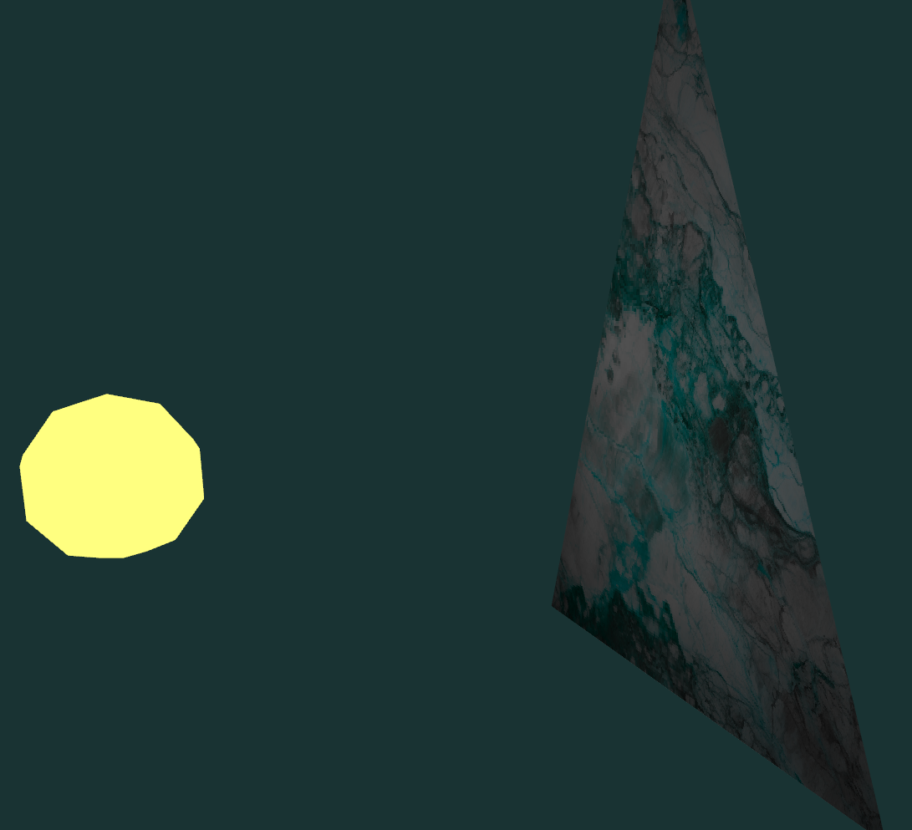

# Introduction cours 6 : Illumination de base

* Simuler une ampoule qui éclaire un triangle texturé.
* Ampoule plus proche = triangle mieux éclairé.
* Facteur d'intensité est 1/*d*² (loi du carré inverse).
* Modifier le nuanceur [lit_frag.glsl](lit_frag.glsl) en calculant et appliquant le facteur d'intensité au fragment.
* Chaque fragment reçoit sa position de scène en entrée (`sceneCoords`).
* La position de la lumière est une variable uniforme `lightPosition`.

## Contrôles

* F5 : capture d'écran.
* R : réinitialiser la position de la caméra.
* \+ et - :  rapprocher et éloigner la caméra orbitale.
* haut/bas : changer la latitude de la caméra orbitale.
* gauche/droite : changer la longitude ou le roulement (avec shift) de la caméra orbitale.
* clic droit ou central : bouger la caméra en glissant la souris.
* roulette : rapprocher et éloigner la caméra orbitale.
* WASD : Bouger la source de lumière dans le plan *xz*.
