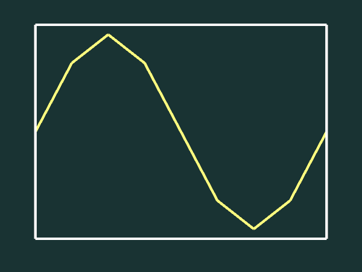
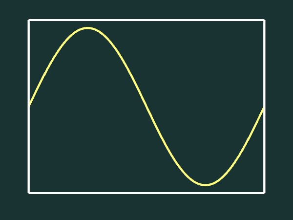

# Introduction cours 8 : Tessellation

* Dessiner une onde sinusoïdale qui change dans le temps.
* Le nombre de segments de la courbe change dynamiquement.
* Le maillage de la courbe doit donc être regénéré à chaque trame.
* La courbe est segmentée selon son axe des *x* entre 0 et 1 et l'onde varie en *y*.
* Par exemple, une courbe à 3 segments aurait 4 points [0, 0.25, 0.5, 1]
* La formule de l'onde est *y* = sin(2π(*t* + *x*)), où *t* vous est donné.
* Modifier la partie de `drawFrame()` dans [main.cpp](main.cpp) qui met à jour les points dans le maillage.

## Contrôles

* F5 : capture d'écran.
* R : réinitialiser la position de la caméra.
* \+ et - :  rapprocher et éloigner la caméra orbitale.
* haut/bas : changer la latitude de la caméra orbitale.
* gauche/droite : changer la longitude ou le roulement (avec shift) de la caméra orbitale.
* clic droit ou central : bouger la caméra en glissant la souris.
* roulette : rapprocher et éloigner la caméra orbitale.
* 1 et 2 : diminuer/augmenter le nombres de segments de la courbe.
